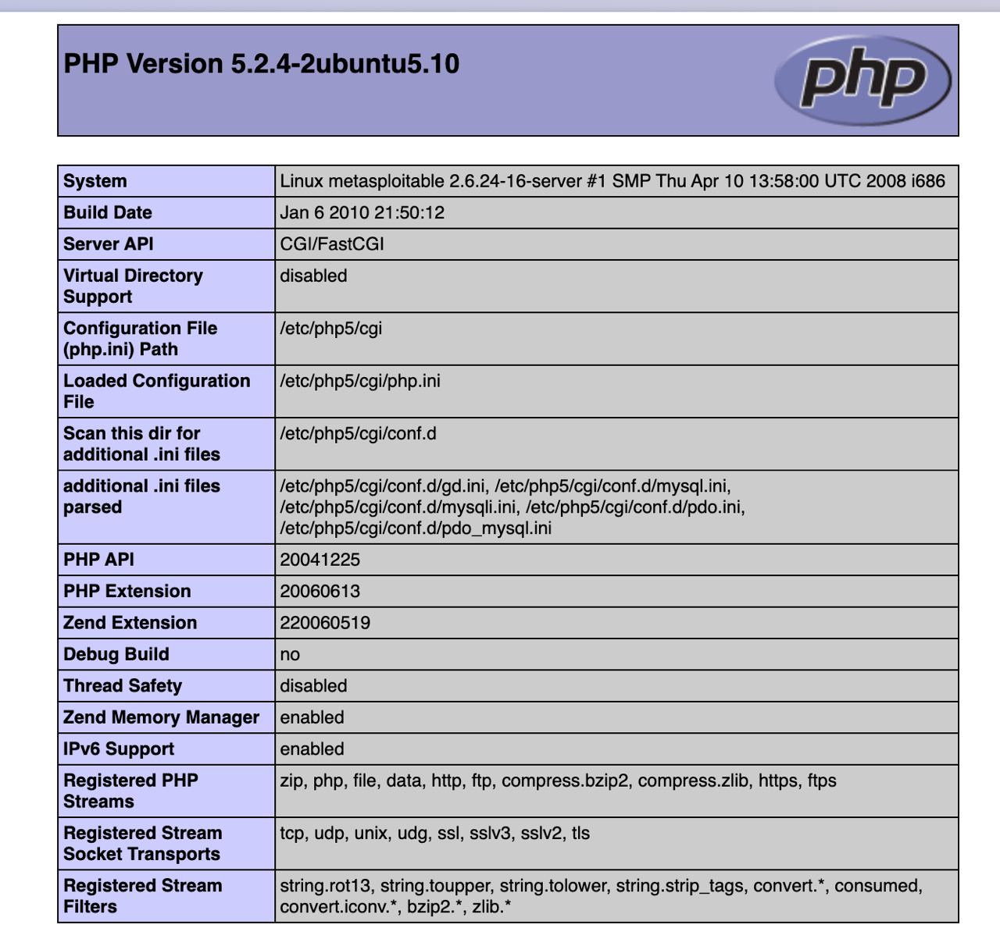
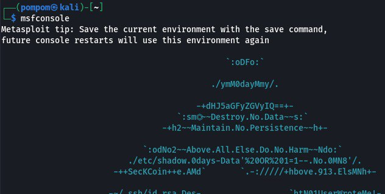
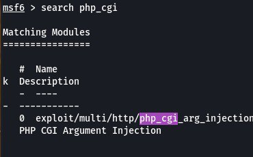
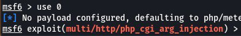
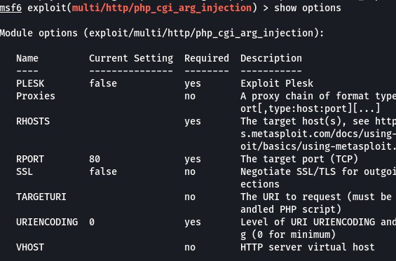
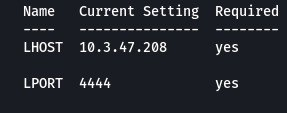
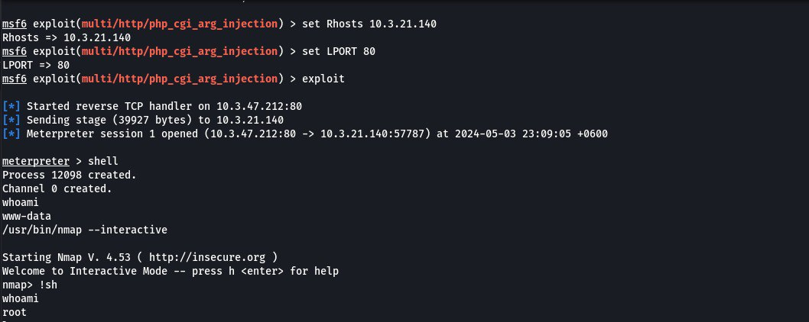
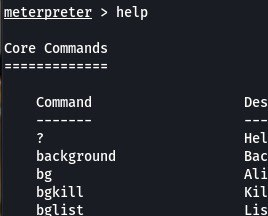
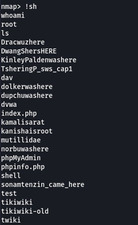

# port 80 

### Identifying Vulnerabilities

**http** require tools like Burp Suite, OWASP ZAP, and Wireshark, which in this case I've used metasploit.

They are usually not immediately visible without deep inspection.

Despite these difficulties, it remains a critical aspect of cybersecurity, helping to identify and mitigate potential threats to web applications and services.

### Exploitation

From the information i got from inside the target ip especially with phpinfo.php endpoint, this is the first gateaway to get inside the vulnerable http port.

The PHP-CGI effects exploiting an HTTP port stems from its configuration and the vulnerabilities present in older versions.

Snce we got a vulnerability now, we can easily use metasploit to gain root access.

This is not where it ends. Now we've reached the section where we get to configure essential paramaters that determine how the exploit or payload communicates with the target system or the listener.

and we run

.jpg>)

**but what is...meterpreter?**

I tried to research what a meterpreter is. 

So basically, ***Meterpreter*** is a Metasploit attack payload that provides an interactive shell from which an attacker can explore the target machine and execute code.

**Meterpreter resides entirely in memory and writes nothing to disk.** It means that the Meterpreter payload operates solely within the RAM of the compromised system without creating any persistent files on the disk

First things first. Always run command **help** first.

After studying hard, basically there was a way to open the meterpreter shell

.jpg>)

**/usr/bin/nmap**

This executes a powerful open-source tool used for network exploration and security auditing. Why ***nmap*** is because it discover hosts and services creating a 'map'.

This is how we get into nmap's shell and the last step of our penetration process as we have successfully gained root access and can upload or retrieve data.

