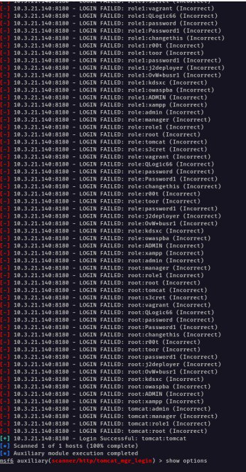
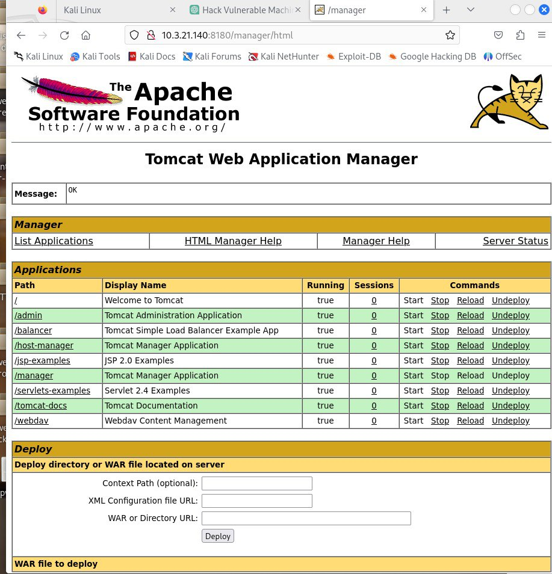

# port 8180 

The whole process repeats;

* open msfconsole
* search for vulnerabilities
* configure for manipulation
* configure payloads

.jpg>)
.jpg>)
.jpg>)

Here a very huge change, the tool bruteforces usernames and passwords and returns the only correct pair.

The correct username and password pair shall be used to login in the page the url leads us to

**10.3.21.140:8180**

.jpg>)

