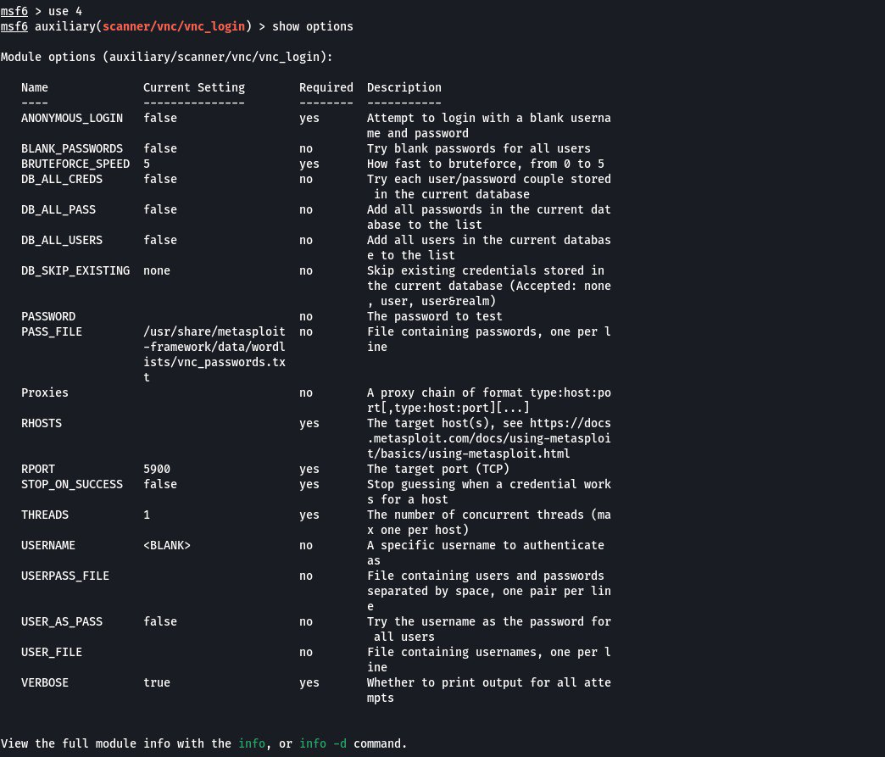

# port 5900

Run **msfconsole** to use metasploit again. The next step as same as before, search for vulnerabilities. After that, configure required changes needed to be outputted.

.jpg>)

Execution completed. This means we can log into the vnc server.

As you can see the credentials have worked and we are definitely in the metasploitable machine.

This extracts passwords associated with user accounts linux has stored into the system.
 
For example, if you are interested in the root password 

