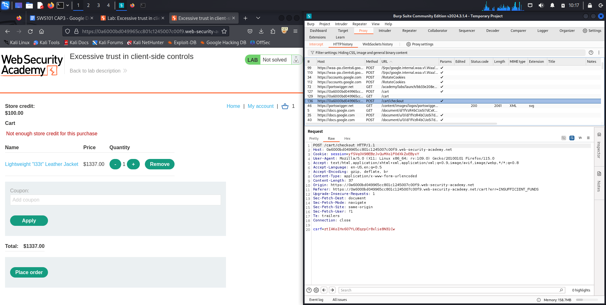
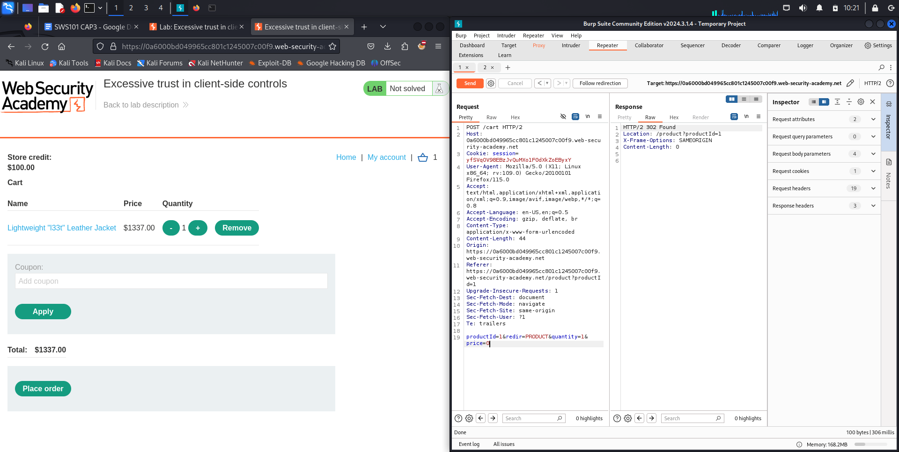

# Bug Bounty Case Study

Performing online web security testing on online lab environments.

You are a Bug Bounty Hunter who checks website security for a living and RUB has hired you to check vulnerabilities in an online lab environment.

## PortSwigger labs
## Table of contents

* Business-logic vulnerabilities
* Authentication 
* API Testing 
* Access Control 

## Business-logic vulnerabilities

### 1. Excessive trust in client-side controls

With Burp running, log in and attempt to buy the leather jacket. The order is rejected because you don't have enough store credit.

Login in as wiener intercept add to cart request and change the price to 1.

In Burp, go to "Proxy" > "HTTP history" and study the order process. Notice that when you add an item to your cart, the corresponding request contains a price parameter. Send the POST /cart request to Burp Repeater.

In Burp Repeater, change the price to an arbitrary integer and send the request. Refresh the cart and confirm that the price has changed based on your input.

There seems to be a vulnerability in **/cart** endpoint. Possibility of manipulating the amount of our wanted item is there.

So changing the amount to 0 did not work which means there is a server side validation for the amount to never be 0.

Try putting 1.

And it worked.

![alt text]business_logic/(Screenshot_2024-06-13_10_23_59.png)

### 2. High-level logic vulnerability

With Burp running, log in and add a cheap item to your cart.

In Burp, go to "Proxy" > "HTTP history" and study the corresponding HTTP messages. Notice that the quantity is determined by a parameter in the POST /cart request.

Go to the "Intercept" tab and turn on interception. Add another item to your cart and go to the intercepted POST /cart request in Burp.

Change the quantity parameter to an arbitrary integer, then forward any remaining requests. Observe that the quantity in the cart was successfully updated based on your input.

Repeat this process, but request a negative quantity this time. Check that this is successfully deducted from the cart quantity.

Request a suitable negative quantity to remove more units from the cart than it currently contains. Confirm that you have successfully forced the cart to contain a negative quantity of the product. Go to your cart and notice that the total price is now also a negative amount.

Add the leather jacket to your cart as normal. Add a suitable negative quantity of the another item to reduce the total price to less than your remaining store credit.

Place the order to solve the lab.

### 3. Inconsistent handling of exceptional input

While proxying traffic through Burp, open the lab and go to the "Target" > "Site map" tab. Right-click on the lab domain and select "Engagement tools" > "Discover content" to open the content discovery tool.

Click "Session is not running" to start the content discovery. After a short while, look at the "Site map" tab in the dialog. Notice that it discovered the path /admin.

Try to browse to /admin. Although you don't have access, an error message indicates that DontWannaCry users do.

Go to the account registration page. Notice the message telling DontWannaCry employees to use their company email address.

From the button in the lab banner, open the email client. Make a note of the unique ID in the domain name for your email server (@YOUR-EMAIL-ID.web-security-academy.net).

The very-long-string should be at least 200 characters long. 7. Go to the email client and notice that you have received a confirmation email. Click the link to complete the registration process. 8. Log in and go to the "My account" page. Notice that your email address has been truncated to 255 characters. 9. Log out and go back to the account registration page. 10. Register a new account with another long email address, but this time include dontwannacry.com as a subdomain in your email address as follows:

Make sure that the very-long-string is the right number of characters so that the "m" at the end of @dontwannacry.com is character 255 exactly. 11. Go to the email client and click the link in the confirmation email that you have received. Log in to your new account and notice that you now have access to the admin panel. The confirmation email was successfully sent to your email client, but the application server truncated the address associated with your account to 255 characters. As a result, you have been able to register with what appears to be a valid @dontwannacry.com address. You can confirm this from the "My account" page. 12. Go to the admin panel and delete Carlos to solve the lab.

## Authentication

### 1. Username enumeration via different responses

With Burp running, investigate the login page and submit an invalid username and password.

In Burp, go to Proxy > HTTP history and find the POST /login request. Send this to Burp Intruder.

In Burp Intruder, go to the Positions tab. Make sure that the Sniper attack type is selected.

Click Clear § to remove any automatically assigned payload positions. Highlight the value of the username parameter and click Add § to set it as a payload position. This position will be indicated by two § symbols, for example: username=§invalid-username§. Leave the password as any static value for now.

On the Payloads tab, make sure that the Simple list payload type is selected.

Under Payload options, paste the list of candidate usernames. Finally, click Start attack. The attack will start in a new window.

When the attack is finished, on the Results tab, examine the Length column. You can click on the column header to sort the results. Notice that one of the entries is longer than the others. Compare the response to this payload with the other responses. Notice that other responses contain the message Invalid username, but this response says Incorrect password. Make a note of the username in the Payload column.

Close the attack and go back to the Positions tab. Click Clear, then change the username parameter to the username you just identified. Add a payload position to the password parameter. The result should look something like this:

### 2. 2FA simple bypass

Log in to your own account. Your 2FA verification code will be sent to you by email. Click the Email client button to access your emails.

Go to your account page and make a note of the URL.
Log out of your account.

Log in using the victim's credentials.

**URL:/my-account?id=xxx**

Then switch to account carlos and access /my-account?id=carlos manually:

When prompted for the verification code, manually change the URL to navigate to /my-account. The lab is solved when the page loads.

### 3. Password reset broken logic

With Burp running, click the Forgot your password? link and enter your own username.
Click the Email client button to view the password reset email that was sent. Click the link in the email and reset your password to whatever you want.

In Burp, go to Proxy > HTTP history and study the requests and responses for the password reset functionality. Observe that the reset token is provided as a URL query parameter in the reset email. Notice that when you submit your new password, the POST /forgot-password?temp-forgot-password-token request contains the username as hidden input. Send this request to Burp Repeater.

In Burp Repeater, observe that the password reset functionality still works even if you delete the value of the temp-forgot-password-token parameter in both the URL and request body. This confirms that the token is not being checked when you submit the new password.

In your browser, request a new password reset and change your password again. Send the POST /forgot-password?temp-forgot-password-token request to Burp Repeater again.
In Burp Repeater, delete the value of the temp-forgot-password-token parameter in both the URL and request body. Change the username parameter to carlos. Set the new password to whatever you want and send the request.
In your browser, log in to Carlos's account using the new password you just set. Click My account to solve the lab.

### 4. Username enumeration via subtly different responses

With Burp running, submit an invalid username and password. Send the POST /login request to Burp Intruder and add a payload position to the username parameter.
On the Payloads tab, make sure that the Simple list payload type is selected and add the list of candidate usernames.

On the Options tab, under Grep - Extract, click Add. In the dialog that appears, scroll down through the response until you find the error message Invalid username or password.. Use the mouse to highlight the text content of the message. The other settings will be automatically adjusted. Click OK and then start the attack.
When the attack is finished, notice that there is an additional column containing the error message you extracted. Sort the results using this column to notice that one of them is subtly different.

Look closer at this response and notice that it contains a typo in the error message - instead of a full stop/period, there is a trailing space. Make a note of this username.
Close the attack and go back to the Positions tab. Insert the username you just identified and add a payload position to the password parameter:

***username=identified-user&password=§invalid-password§***

On the Payloads tab, clear the list of usernames and replace it with the list of passwords. Start the attack.

When the attack is finished, notice that one of the requests received a 302 response. Make a note of this password.

## API Testing

### 1. Exploiting an API endpoint using documentation

Before starting the challenge, make sure to launch Burp Suite. Once its running, log in to the account uing the credentials provided in the challenge description.

After logging in, you will see an option to update the email address. Enter a random email address in the field and click on **update**.

Next, go back to Burp and navigate to the "HTTP history" tab under the proxy section. Locate the request with PATCH/api/user/wiener and send it to the Repeater.

Be aware that we want to try all kinds of http request queries on the api to see if it works anything.

In the Repeater window, click on the **send** button and examine the response. You should see the user credentials displayed.

Now remove **/wiener** and replace with **/carlos** from the path of the request and click send again. This results in an error.

Next, remove **/user** from the path, so the endpoint becomes **/api**, and send the request again. This retrieves the API documentation.

Right-click on the response and select "Show Response in Browser". Copy the URL provided. Give the url in a browser which will display the doc. Find the **DELETE** row and click on it.

Enter **carlos** and send request.

## 2. Exploiting server-side parameter pollution in a query string

To solve the lab, my goal is to log in as the administrator and delete the user Carlos.

In this case, no specific account credentials are given. The only feature accessible is the password rest function, which only avoids errors when the username is **administrator**; for other usernames, it states that the username doesn't exist.

If you login as a normal user for example, this happens.

We are not authorised to use the email

Trying the **option** request but it throws an error.

So reset it back to get and render the api. 

Checking the page source to find a **reset_token** function which could possibly help manipulate the system into authorisation. But unfortunately it doen not work :(

I can try paramater manipulation by using **username=administrator%23**. But it says bad request.

Lets try more manipulation ways.

This seemed to work as i exchanged the two usernames places. 

This indicates the parameter isn't supported, suggesting the server may have intercepted it. Since the field isn't specified, send the request to the intruder tool for the brute-forcing. But it seems to lead nowhere so i will quit it here.

While reviewing historical messages in Burp, a JavaScript file revealed that the password reset URL is “/forgot-password?reset_token=${}”. Obtaining the resetToken enables you to reset the user’s password.

Modify the request to include the reset_token and check its response. By accessing it, I can successfully reset the administrator's password.

## Access Control Vulnerabilities

### 1. Unprotected admin functionality

This lab has an unprotected admin panel. So we can directly access /robots.txt

Here we got the correct endpoint to access the admin panel. So copy and paste it to our url.

Delete the user **carlos**

### 2. Unprotected admin functionality with unpredictable URL

This time there is no information in the robots.txt file. Lets try viewing the page source.

The admin interface's URL has been leaked. Just use it.

### 3. User role controlled by request parameter

Attempt to access admin panel upon logging in using wiener:peter.

Admin interface only available if logged as an administrator. The **admin** field in the cookie has a value of **false**. Change it to true before repeating again.

