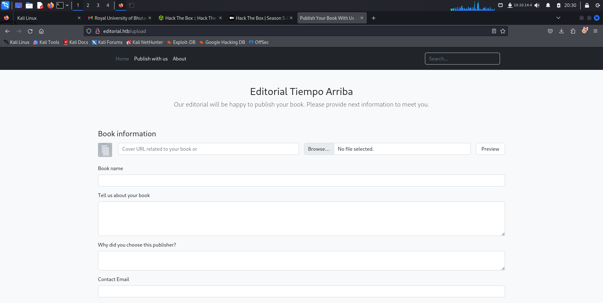

# Editorial.htb

Let me browse the IP address but it resolves an http address. I will add it to my /etc/hosts file and browse it.

Similarly, now we'll do the nmap scan of the ip.

The nmap scan gives us port 22 ssh and port 80 http open. Let's browse the website. 

Now I'll do a scan with ffuf to examine any subdomains and vhosts. Unfortunately, could not find anythin here.

So let me go a explore the site. It seems like it is a book library and users can seem to upload books. There is a search bar but does not do anything.

Here we have a form to upload a book, information about a book.

Its a webpage so we obviously have to try work with burp suite. I'll try to upload a file and see what happens.

I set up my proxy and intercept the request. 

**Cover url: www.google.it**

The upload is asking for a pdf so I downloaded one and added.

There seems to be a preview button. I need to inspect it and see what it does.

I will send the upload-cover request to repeater and forward from the proxy.

Now do a post to upload cover, pass the **www.google.it** here and the format is pdf.

Now I basically have two roads; the easiest one is when i upload this file, I visit the upload cover endpoint to actually see if these files are navigable. the other road is to try loading a reverse shell, recall it and put a listener on my terminal.

Lets forward this preview and I expect to find something on upload-cover.

Here, the GET upload-cover doesn't give us anything back.If i send this request the answer to this static image is nothing but the preview of the pdf I uploaded earlier.

Method no2 is seeing if the parameters are changed. I will try to upload a reverse shell and see if it works.

So lets try to activate netcat listener here, go to http://10.10.14.34:1234

This clearly shows this website is vulnerable to server-side request. It is an SSRF vulnerability.

An **SSRF** vulnerability allows an attacker to route and manipulate a call server towards an external server, therefore even towards my terminal.

However any other server or endpoint that we want to set up ourselves or even to others internal resources accessible only, in this case, back to http and perhaps not accessible to us from the outside since we can see that the only open ports are 22 and 80 but, maybe editorial.htb sp 10.10.11.20 can see other ports connected to this service.

This type of vulnerability is called Server Side Request Forgery Out of Bound.

I need to make a call to localhost then to ourselves and fuzze the endpoint, the port i will go to to call looking for different types of answers, looking to see if any open host is available. I can use ffuf for that.

Lets go back to our proxy.

I activate the interception and give it the address 127.0.0.1 port 10

Now I will fuze this. So i copy the curl call

Here i have all calls of the same size which are probably equivalent to the size we saw before.

To filter by size, lets exclude that is size 61. It finished all 10,000 calls and i found something on port 5000.

Set the payload type as Numbers with From 1 TO 65535 and Step 1. And ATTACK!

Once done use filters to filter out the results which has the usual jpeg endpoint in the response and got the 5000 port as the different with a different endpoint in the response.

When the endpoint was tried in the browser it download a file with the below information:

***cat <file>| jq***

Well, we have no other choice that hit all the API endpoints, obviously!

When the endpoint /api/latest/metadata/messages/authors was hit I got an interesting file download. When read, it gave this output:

***cat b8ffe342-09ba-473a-967d-4915a4e13594| jq ***

{
  "template_mail_message": "Welcome to the team! We are thrilled to have you on board and can't wait to see the incredible content you'll bring to the table.\n\nYour login credentials for our internal forum and authors site are:\nUsername: dev\nPassword: dev080217_devAPI!@\nPlease be sure to change your password as soon as possible for security purposes.\n\nDon't hesitate to reach out if you have any questions or ideas - we're always here to support you.\n\nBest regards, Editorial Tiempo Arriba Team."                             
}

Here we got a user name: dev and password:dev080217_devAPI!@. But we don’t have any login page, where to use them ? 🤔

Remeber we found the ssh port 20 open, let’s use it there.

We have our user flag right in the directory itself

Acquired the first flag!

## System Flag

I was stuck here a little trying random stuff but none of them worked. There I remember since the directory’s name is app, it might have .git or .docker in it and guess what.

It is there.

Let’s go in there and do a git log command and try different commits in the command git show “commit”. Tried all the them. Found an interesting one.

In this they have changed the prod credentials to the dev credentials that we found earlier. Let’s ssh into the prod user now

**ssh prod@10.10.11.20**

Again it worked! I really thought the flag would be here but no it wasn’t. Guess we still have to hustle.

Since there were no direct leads, I tried the go to command for priv escalation.

This means that with sudo privileges we can run python3 command above mentioned python code. Let’s see what it is.

When analysing the code files and the packages using the command pip3 list, found that 1 package that was vulnerable. It was GitPython 3.1.29 which was affected by a RCE Vulnerability listes as CVE-2022–24439.

Let’s try the exploit mentioned in the POC I reference:

Since we are seeing error related to the python3 execution it means that the python file was executed as root user.

Now let’s tweak it to retrieve the root.txt contents from the /root directory.

